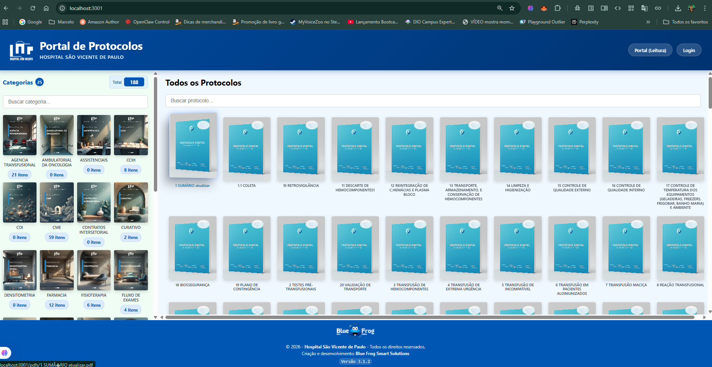
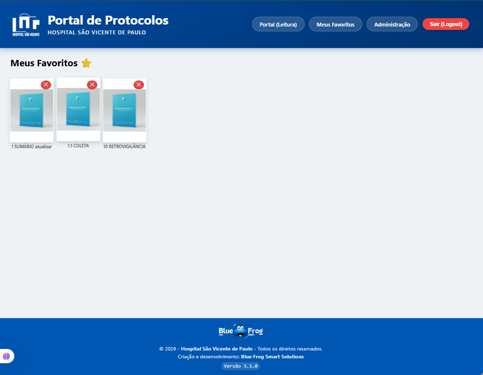
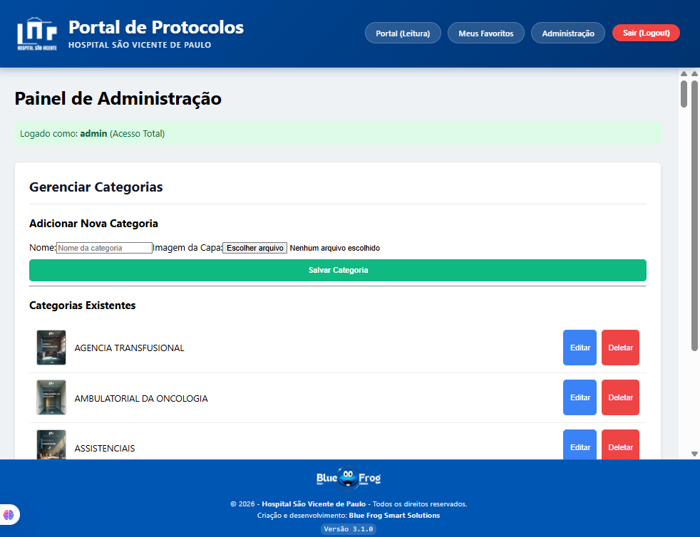
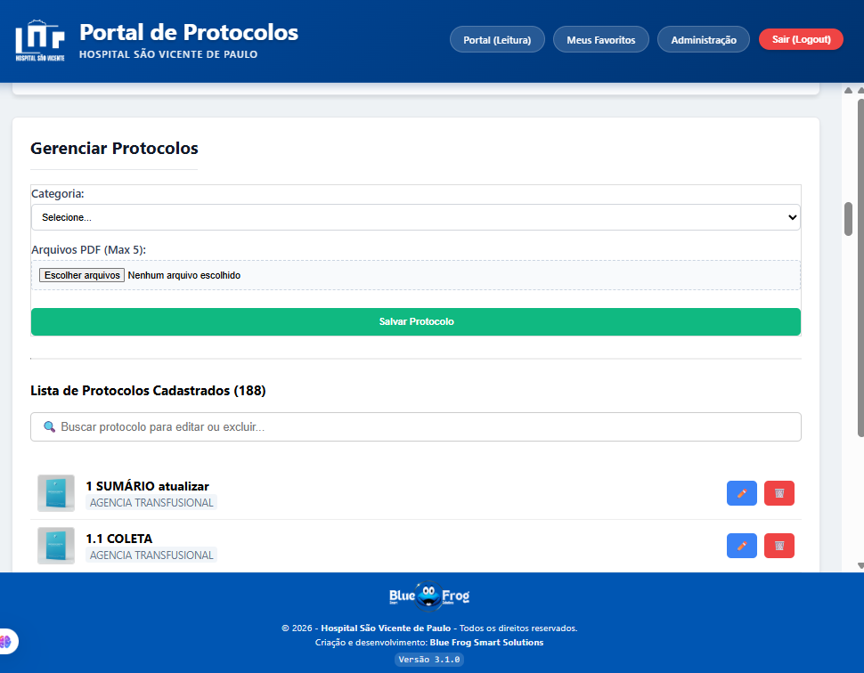

# 🏥 Portal de Protocolos Internos - HSVP

Sistema Full Stack desenvolvido para o **Hospital São Vicente de Paulo**, centralizando o acesso aos Protocolos Operacionais Padrão (POPs) para médicos e colaboradores via Computador e Dispositivos Móveis.

---

## 🚀 Histórico de Versões

### v3.1.2 (Atual - Auto-Detect & Grid Fix)
* **📡 API Inteligente:** Implementação de detecção automática de IP. O sistema agora funciona simultaneamente em `localhost` e na Rede sem necessidade de configuração manual.
* **📱 Grid Responsivo:** Correção do layout dos cards de protocolos, utilizando `auto-fill` e `aspect-ratio` para evitar distorções em telas menores.
* **🔧 Hotfix de Login:** Ajuste na importação de serviços para garantir estabilidade no build.

### v3.1.1
* **✨ UX Polish:** Visual Híbrido (Efeitos 3D no Desktop / Tactile Press no Mobile).
* **Refinamento:** Ajustes finos de CSS para dispositivos móveis.

### v3.1.0
* **Infraestrutura:** Servidor Unificado Node.js.
* **Backup:** Sistema redundante.

---

## 📸 Galeria do Sistema

Aqui estão algumas telas do sistema em funcionamento:

### 🏠 Acesso Público e Leitura
| Tela de Login | Tela Inicial (Home) |
| :---: | :---: |
|  |  |  |

### ⭐ Funcionalidades do Usuário
| Meus Favoritos | Visualização Mobile |
| :---: | :---: |
|  | *Interface Responsiva* |

### ⚙️ Painel Administrativo
| Gestão de Categorias | Gestão de Protocolos |
| :---: | :---: |
|  |  |

---

## 📋 Como Rodar o Projeto

### Inicialização Automática
O sistema roda em segundo plano através do **PM2**.

* **Acesso no Servidor:** `http://localhost:3001`
* **Acesso na Rede:** O IP pode variar. Verifique o endereço atual com o comando `ipconfig` no terminal do servidor.
    * *Exemplo:* `http://192.168.0.XXX:3001`

---

## 🔄 Como Atualizar (Deploy)

Sempre que alterar o código, siga este passo único:

1.  Vá até a pasta raiz do projeto.
2.  Dê um duplo clique no arquivo:
    👉 **`DEPLOY_AUTOMATICO.bat`**
3.  Aguarde a tela preta fechar.

---

## 🛡️ Backup e Segurança

**Como fazer o Backup:**
1.  Execute o arquivo: 👉 **`BACKUP_TOTAL_V3.bat`**
2.  O script salvará tudo em `C:\Backups_Portal` e `E:\BlueFrog\Backups_Portal`.

---

## 👤 Autor

**Marcelo Santos**
*Desenvolvedor Full Stack & TI no Hospital São Vicente de Paulo*
"Blue Frog Smart Solutions" 🐸💙

---
© 2026 Hospital São Vicente de Paulo. Todos os direitos reservados.