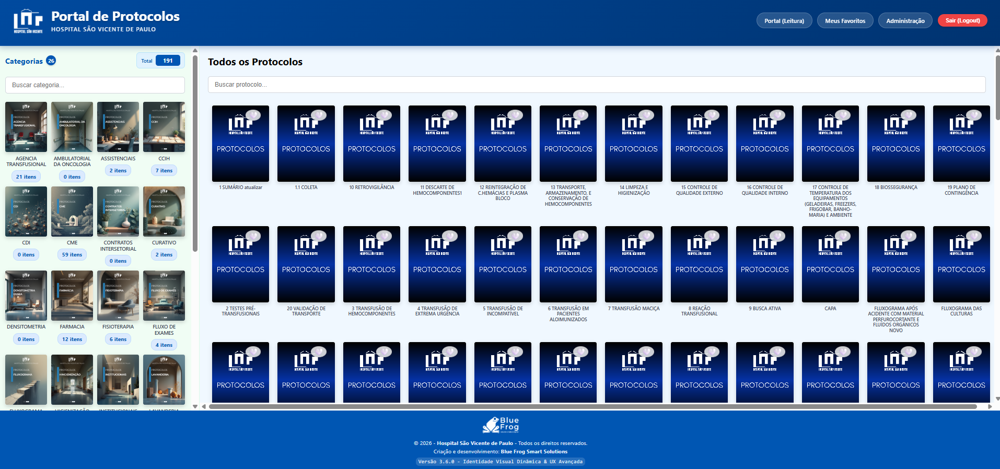
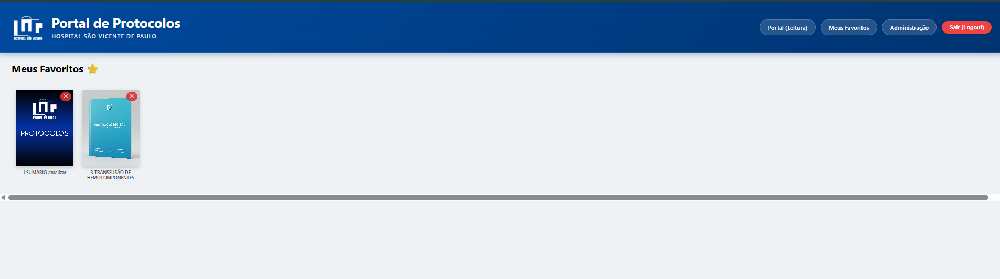
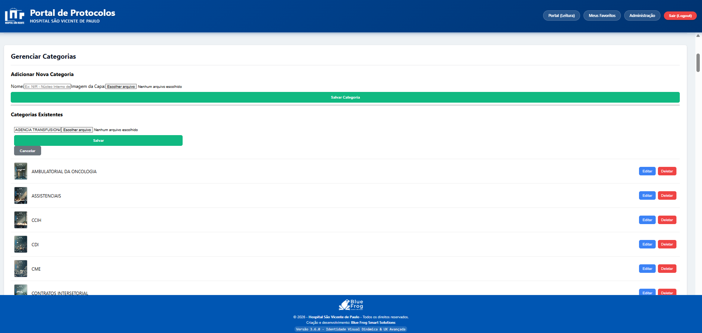
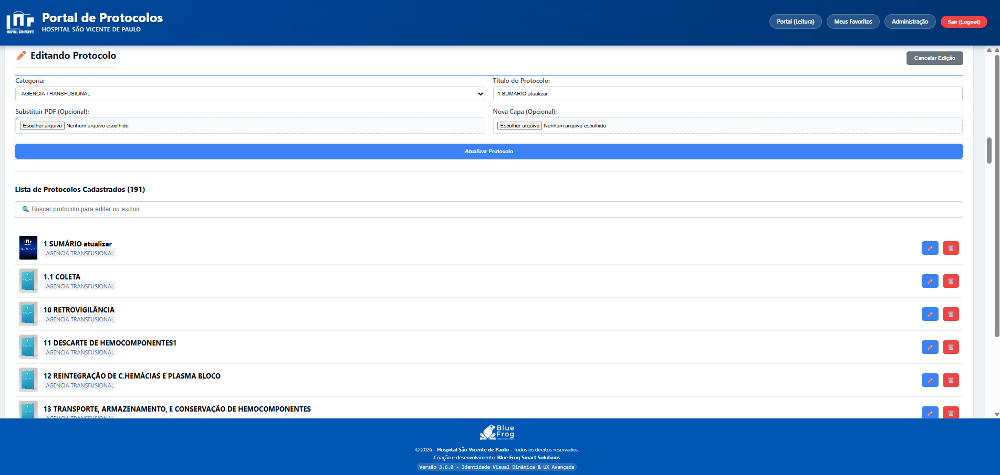

# 🏥 Portal de Protocolos Internos - HSVP

Sistema Full Stack desenvolvido para o **Hospital São Vicente de Paulo**, centralizando o acesso aos Protocolos Operacionais Padrão (POPs) para médicos e colaboradores via Computador e Dispositivos Móveis.

---

## 🚀 Histórico de Versões

### v3.1.4 (Atual - Exclusão Inteligente & Gestão de Integridade)
* 🛡️ **Segurança Relacional (Integridade Referencial):** Implementação de restrição preventiva em cascata no motor de exclusão de categorias. O sistema agora barra automaticamente a remoção de categorias que contenham protocolos vinculados, evitando que ficheiros PDF fiquem órfãos ou sejam apagados por engano.
* ⚡ **Exclusão em Lote Controlada (UX/UI):** Adicionada a capacidade de confirmação contextual em dois passos. Caso o administrador deseje remover uma categoria ocupada juntamente com todo o seu conteúdo, o sistema apresenta um aviso com a contagem exata e executa a faxina atômica (banco de dados, tabela de favoritos e binários em disco) com apenas dois cliques conscientes.

### v3.1.3 (Governança de Infraestrutura & DNS)
* 🌐 **Governança de Rede:** Migração do Hostname legado para o padrão corporativo definitivo (`DIWGP-0004`).
* 🛣️ **Resolução de Nomes (DNS):** Criação e validação do CNAME `protocolos.saovicente.lan` no Active Directory (`IWGP-ADDS02`), isolando o frontend do hospital (Home no IP 192.168.0.11) de flutuações de IP no servidor da aplicação.

### v3.1.2 (Auto-Detect, Grid Fix & Infra)
* **🌐 Resiliência de Rede:** Configuração de acesso via Hostname (`http://protocolos.saovicente.lan:3001/`) no Portal principal, garantindo estabilidade mesmo com IPs dinâmicos (DHCP).
* **📡 API Inteligente:** Implementação de detecção automática de IP. O sistema roda simultaneamente em `localhost` e na Rede sem necessidade de configuração manual.
* **📱 Grid Responsivo:** Correção do layout dos cards de protocolos, utilizando `auto-fill` e `aspect-ratio` para evitar distorções em telas menores.

### v3.1.0 / v3.1.1
* **Infraestrutura:** Servidor Unificado Node.js.
* **UX Híbrida:** Efeitos 3D no Desktop e *Tactile Press* no Mobile.

---

## 📸 Galeria do Sistema

Aqui estão algumas telas do sistema em funcionamento:

### 🏠 Acesso Público e Leitura
| Tela de Login | Tela Inicial (Home) |
| :---: | :---: |
|  |  |

### ⭐ Funcionalidades do Usuário
| Meus Favoritos | Visualização Mobile |
| :---: | :---: |
|  | *Interface Responsiva* |

### ⚙️ Painel Administrativo
| Gestão de Categorias | Gestão de Protocolos |
| :---: | :---: |
|  |  |

---

## 📋 Como Rodar o Projeto

### Inicialização Automática
O sistema roda em segundo plano através do **PM2**.

* **Acesso Oficial na Intranet (Recomendado):** http://protocolos.saovicente.lan:3001/
  *Nota: Utilizamos o Alias (CNAME) apontando para o Hostname corporativo (DIWGP-0004) para blindar o link caso o roteador mude o IP dinâmico do servidor local.*
* **Acesso no Servidor Físico (Local):** http://localhost:3001

---

## 🔄 Como Atualizar (Deploy)

Sempre que alterar o código, siga este passo único:

1. Vá até a pasta raiz do projeto.
2. Dê um duplo clique no arquivo:
   👉 **`DEPLOY_AUTOMATICO.bat`**
3. Aguarde a janela preta fechar.

---

## 🛡️ Backup e Segurança

**Como fazer o Backup:**
1. Execute o arquivo: 👉 **`BACKUP_TOTAL_V3.bat`**
2. O script salvará tudo em `C:\Backups_Portal` e `E:\BlueFrog\Backups_Portal`.

---

## 👤 Autor

**Marcelo Santos**  
*Desenvolvedor Full Stack & TI no Hospital São Vicente de Paulo*  
"Blue Frog Smart Solutions" 🐸💙

---
© 2026 Hospital São Vicente de Paulo. Todos os direitos reservados.